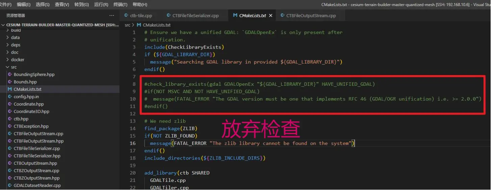

# Cesium地形切片--CTB(cesium-terrain-builder)填坑指南

## 前言

最近公司要求制作全中国的Cesium地形数据，于是开始了一通尝试：

[cesiumlab](http://www.cesiumlab.com/)是一个好用的工具，图形界面操作简单。但是我处理的DEM数据（ASTER Global Digital Elevation Model V003，下载地址：[Earthdata](https://search.earthdata.nasa.gov/search)）上千张，cesiumlab显示要处理近七天，并且会输出几百G的结果，后续数据发布还得各种拷贝十分麻烦，不得不放弃这个方案。（之前公司省级范围的数据就采用的cesiumlab）

每当有问题就看看有没有大佬提供过方案，于是找到了CTB（[cesium-terrain-builder](https://github.com/geo-data/cesium-terrain-builder)），又可以准点下班了，快乐。在服务器上多线程处理数据速度快还不占用自己的办公电脑，处理结果输出后直接发布，岂不美滋滋。

使用CTB遇到的问题如下：

## 编译问题

通过一通gdal的环境部署后，CTB居然cmake不通过，报错："The GDAL version must be one that implements RFC 46 (GDAL/OGR unification) i.e. >= 2.0.0"，然而我是用的是gdal-3.5.0，完全不应出现该问题，于是注释Cmakelists中的check



注释后通过cmake，但是出现了编译报错，原因是gdal接口不匹配，于是改用gdal-2.4.4，编译通过！make install后验证通过

验证使用ctb-info:

```bash
[root@localhost build]# ctb-info --version
0.4.1
```

## 瓦片压缩问题

cesium不能直接使用ctb输出的结果，因为每一个terrain文件ctb会使用gzip压缩。所以，为了输出结果直接发布，我需要修改ctb源码让cesium能直接使用输出结果。

写这篇文章主要是因为这个瓦片压缩问题，没想到在写的过程中发现有大佬已经出过文章了：[Cesium Terrain Builder 非压缩瓦片](https://blog.csdn.net/qgbihc/article/details/109212344)

总体来说就是思路就是将原代码的使用的CTBZFileOutputStream改成CTBFileOutputStream，这两个类都是CTBOutputStream的派生，而且在CTB的代码中都已经实现了，所以改动极小便可完成。当然，为了可以控制输出的瓦片是否压缩采用前面大佬的方案更合适。

改前：

```c++
/**
 * @details
 * Serialize a MeshTile to the Directory store
 */
bool ctb::CTBFileTileSerializer::serializeTile(const ctb::MeshTile *tile, bool writeVertexNormals)
{
    const TileCoordinate *coordinate = tile;
    const string filename = getTileFilename(coordinate, moutputDir, "terrain");
    const string temp_filename = concat(filename, ".tmp");

    CTBZFileOutputStream ostream(temp_filename.c_str());
    tile->writeFile(ostream, writeVertexNormals);
    ostream.close();

    if (VSIRename(temp_filename.c_str(), filename.c_str()) != 0)
    {
        throw new CTBException("Could not rename temporary file");
    }
    return true;
}
```

改后：

```c++
/**
 * @details
 * Serialize a MeshTile to the Directory store
 */
bool ctb::CTBFileTileSerializer::serializeTile(const ctb::MeshTile *tile, bool writeVertexNormals)
{
    const TileCoordinate *coordinate = tile;
    const string filename = getTileFilename(coordinate, moutputDir, "terrain");
    const string temp_filename = concat(filename, ".tmp");

    FILE *fp = fopen(temp_filename.c_str(), "wb");
    CTBFileOutputStream ostream(fp);
    tile->writeFile(ostream, writeVertexNormals);
    fclose(fp);

    if (VSIRename(temp_filename.c_str(), filename.c_str()) != 0)
    {
        throw new CTBException("Could not rename temporary file");
    }
    return true;
}
```

## 多数据同时处理问题

然后就是多个tif数据，如何使用ctb的问题。我之前写了个python脚本按顺序处理文件夹下的数据，但是layer.json的合并如果自己手动来十分耗时，让我直接放弃脚本处理。这时候我想到gdal支持虚拟数据集，这个CTB使用的GDAL那么肯定也支持，于是进入tif对应的文件夹生成vrt：

```bash
[root@localhost data]# gdalbuildvrt tiles.vrt *.tif
```

然后处理数据：

```bash
ctb-tile -f Mesh -C -N -o /home/v-minio/data/GisFile/terrain /home/mhl/data/tiles.vrt
```

然后生成json，多加一个-l的命令就是只输出json

```bash
ctb-tile -f Mesh -C -N -l -o /home/v-minio/data/GisFile/terrain /home/mhl/data/tiles.vrt
```
