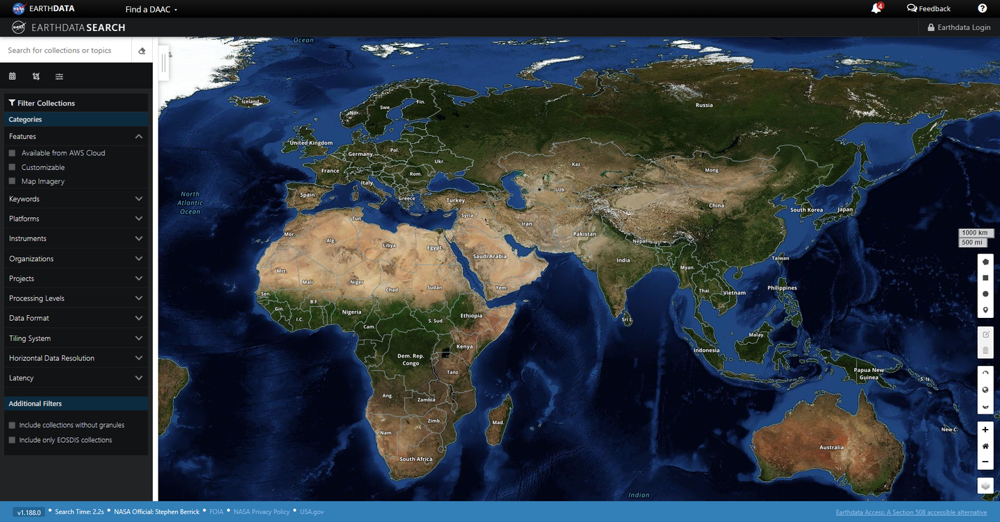
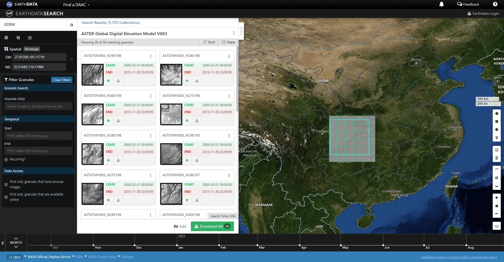
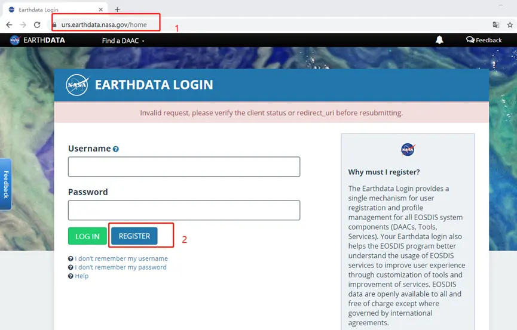
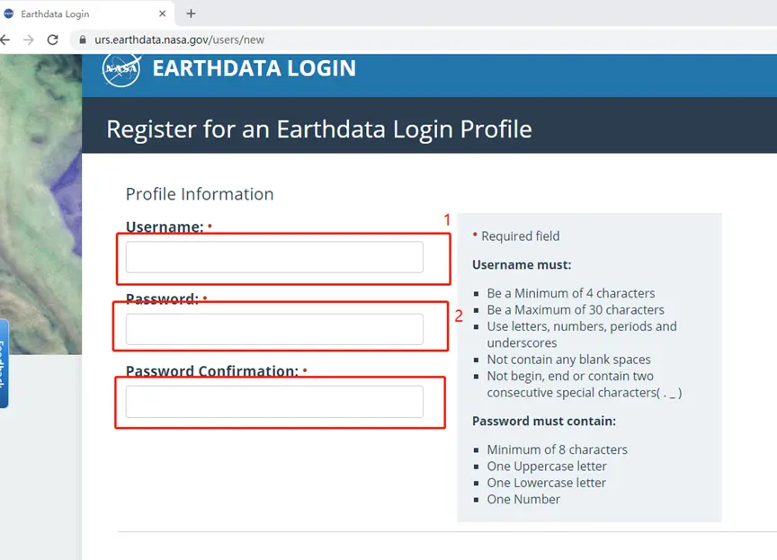
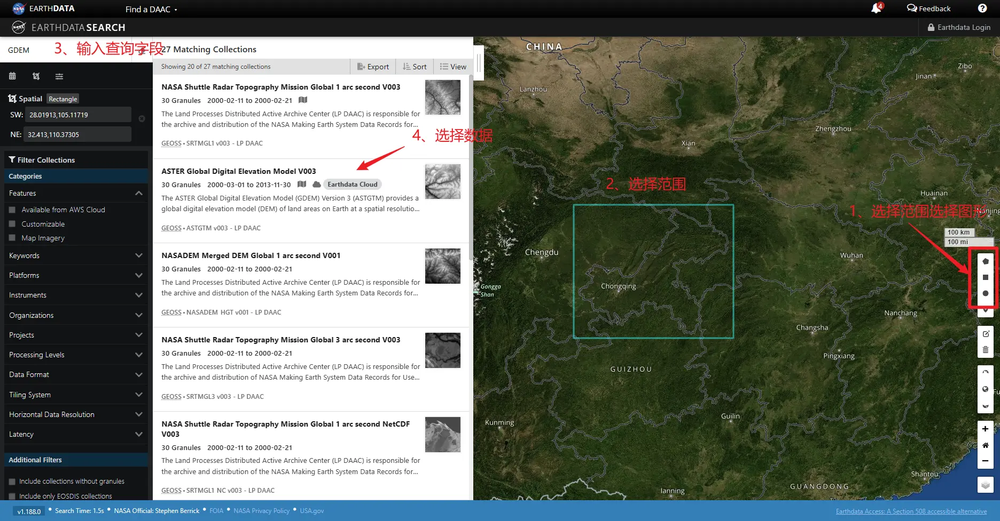
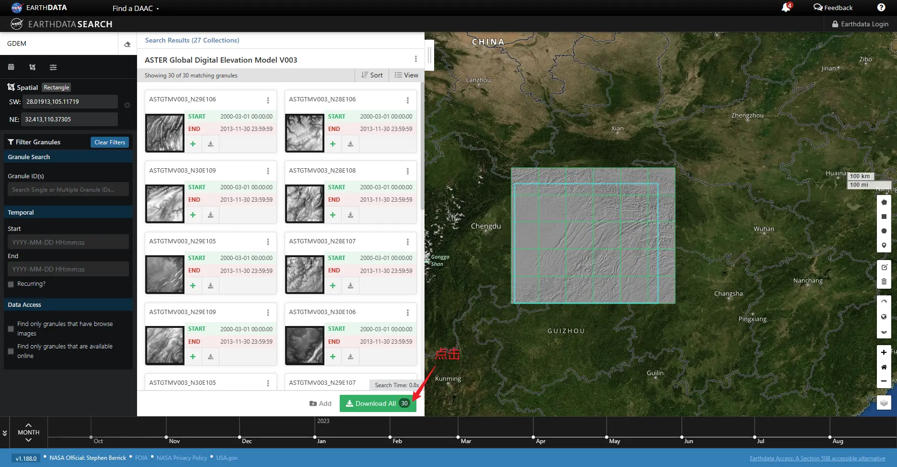
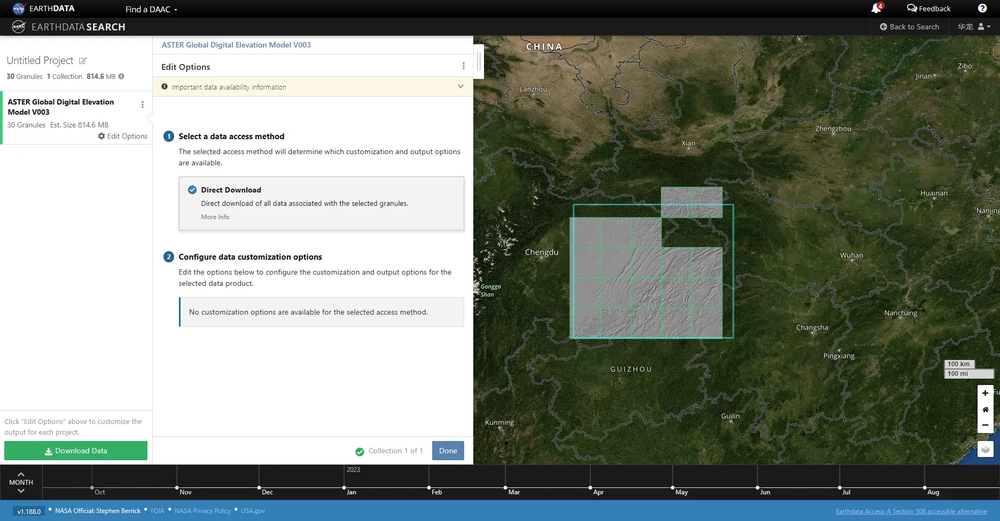
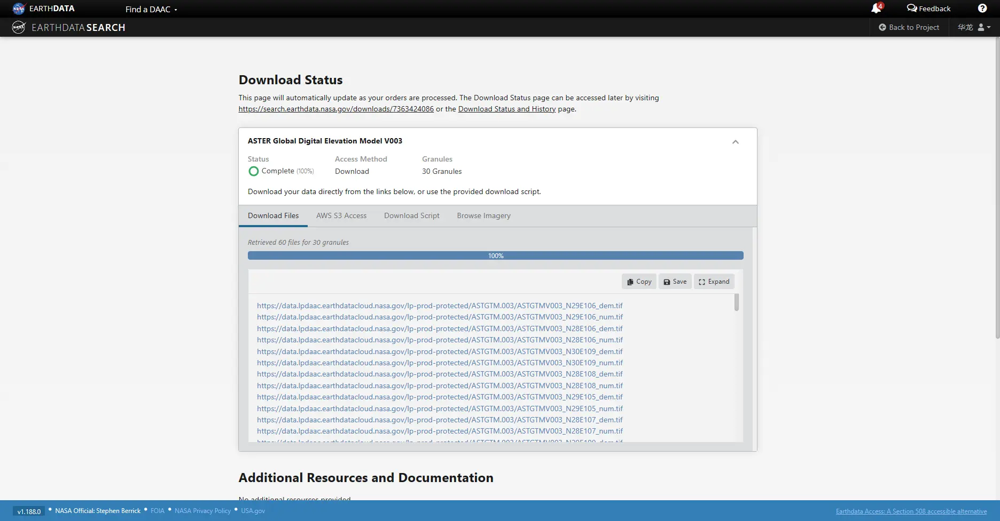
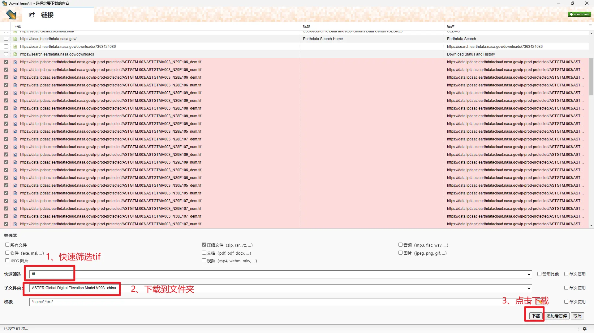

# Earthdata与数字高程模型（DEM）下载教程

## 1、概述

DEM下载的网址很多，个人最喜欢的是earthdata。

Earthdata是美国国家航空航天局（NASA）下属的数据开放平台，具有遥感影像、气候、海洋与陆地等十分丰富的数据。现在GIS研究与应用的地理数据大多来自NASA。

Earthdata下载数据相当简单，进入[Earthdata Search | Earthdata Search (nasa.gov)](https://search.earthdata.nasa.gov/search)，再地图上选择下载区域并在左侧标签栏中选择数据类型后即可完成下载。

## 2、具体步骤

### （1）注册earthdata账号

如有账户直接登录

打开链接[Earthdata Login (nasa.gov)](https://urs.earthdata.nasa.gov/home)，点击注册。

在注册界面输入用户名与密码，完成注册

### （2）数据下载

进入下载页面[Earthdata Search | Earthdata Search (nasa.gov)](https://search.earthdata.nasa.gov/search)，没有登录点击登录。

然后开始数据下载流程：选择范围然后选择数据源：

双击进入数据源，并点击下载”Download All“：

再次点击”Download Data“

最后跳转下载链接界面：

### （3）插件DownThemAll

全是链接如果纯手动点击实在是有点让人绷不住，于是好用的浏览器插件就必不可少了，DownThemAll是一个十分好用的插件，它可以识别当前标签或是所有标签的下载链接，并按顺序并行下载。

