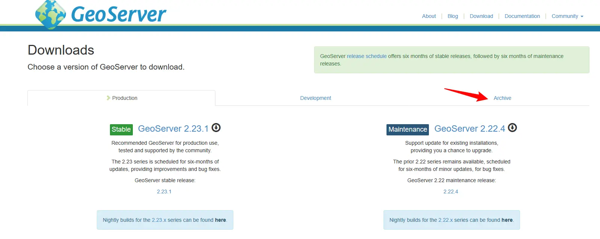
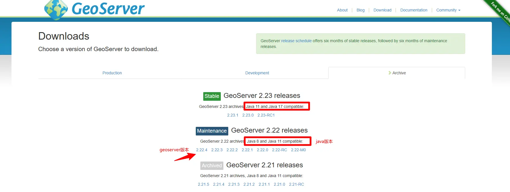
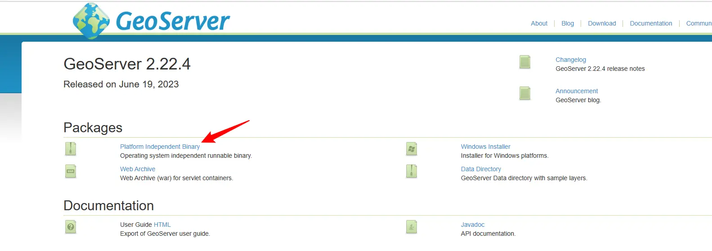
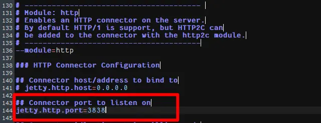
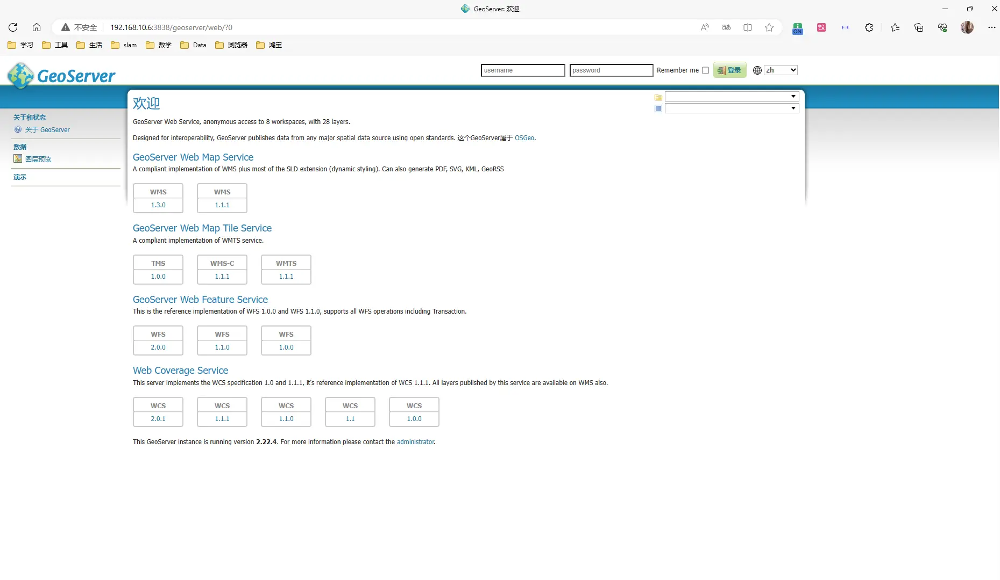

# Geoserver部署：使用自带jetty，简单方便

## 前言

最近打算研究一下使用geoserver的rust api将地理相关服务嵌入公司的云平台系统，实现后台自动对各种地理数据的处理发布。但是在网上一搜，大家都是用的Tomcat+geoserver，感到十分疑惑，geoserver本来就自带了jetty可以自己把服务起起来，为什么要弄一个Tomcat呢？是因为历史原因吗？希望得到大佬解惑。

使用geoserver自带的jetty部署服务十分简单，总结来说就是下载geoserver独立运行文件，然后解压启动服务。只要java版本与geoserver对应，便可直接完成部署。

## geoserver与jetty

GeoServer可以部署在多种Web容器中，如Tomcat、Jetty、JBoss等。GeoServer默认使用Jetty作为Web容器，Jetty是一个轻量级的Web容器，它可以快速启动和运行，而且它的内存占用量比Tomcat更小。此外，Jetty还具有更好的性能和更好的可扩展性。（ps：此为new bing的回答）

## 步骤

以下操作在windos11和CentOS7中完成验证，其他llinux系统应该都差不多。

### 下载geoserver

查看系统java版本，命令如下：

```bash
java -version
```

下载对应版本的geoserver版本的独立可运行文件：

[Download - GeoServer](https://geoserver.org/download/)

打开链接点击Archive，查看历史版本：



根据java版本选择geoserver版本：



进入版本对应下载页，下载独立运行文件：



### 启动geoserver

解压下载的文件，得到以下目录：


进入bin文件夹启动服务，linux下命令行运行 startup.sh；windows下命令行运行 startup.bat。在这里就已经完成了部署，但是此时默认端口为8080，实际使用得更改端口。

ps：直接运行 startup.sh，服务的进程与终端在一起，关闭终端服务就结束了，因此得后台启动服务使用命令nohup，详情参考：

[centos后台运行程序（nohup+screen）](https://www.jianshu.com/p/cb25cca2f8da)

修改端口
打开根目录下的start.ini，修改端口为适合的数字



在CentOS7中修改端口后，需要配置防火墙开启对应端口：

开启端口：

```bash
firewall-cmd --zone=public --add-port=3838/tcp --permanent  
```

重启防火墙完成修改：

```bash
firewall-cmd --reload  
```

访问：


