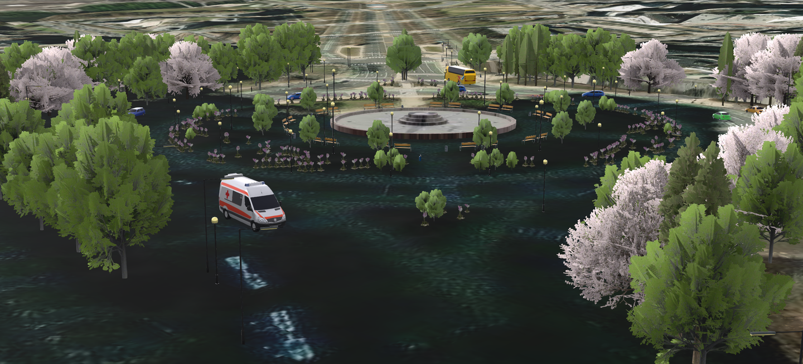

# OSBG转3dTiles，并使用cesium加载3dtiles

OpenSceneGraph binary (OSGB)是一个开源高性能 3D 图形工具包，供视觉模拟、游戏、虚拟现实、科学可视化和建模等领域的应用程序开发人员使用。但是，webgis使用最广泛的cesium主要支持的3d模型还是3dtiles。

当前大量3d模型的格式是osgb，如使用cesium就需要将其转换为3dtiles。

## 模型转换

浏览了网友们留下的智慧，我最终选择了使用开源库3dtiles来实现模型转换，感谢大佬开源，转换快速好用：
 [fanvanzh/3dtiles](https://github.com/fanvanzh/3dtiles)

 使用方法为：
 ```
3dtile.exe -f osgb -i 输入的osgb文件夹路径 -o 输出的3dtiles文件夹路径
 ```

 3dtiles库说明带的示例：

 ```
 # from osgb dataset
3dtile.exe -f osgb -i E:\osgb_path -o E:\out_path
3dtile.exe -f osgb -i E:\osgb_path -o E:\out_path -c "{\"offset\": 0}"
# use pbr-texture
3dtile.exe -f osgb -i E:\osgb_path -o E:\out_path -c "{\"pbr\": true}"
 ```

 转换osgb到3dtiles的参考文章：
 [三维模型：倾斜摄影模型转为3DTiles格式 | Mars3D开发教程](http://mars3d.cn/dev/guide/data/osgb.html#_1-osgb-%E6%A0%BC%E5%BC%8F%E4%BB%8B%E7%BB%8D)
[转换工具汇总 - vps 之家](https://www.91vps.cc/index.php/archives/256/)

## cesium加载3dtiles

cesium加载十分简单，但问题在于osgb转的3dtiles不一定正好在正确的地方。于是，我们加载3dtiles时需要对模型进行“旋转、缩放、平移”，本质上和坐标转换时的七参数转换一致：

```
function add3dTilesByURLAndTR(url, tx, ty, tz, rx, ry, rz, scale) {
  if (!Cesium.defined(url)) return undefined;

  const tileSet = viewer.scene.primitives.add(
    new Cesium.Cesium3DTileset({
      url: url,
      skipScreenSpaceErrorFactor: 16,
      shadows: Cesium.ShadowMode.DISABLED,
    })
  );

  return tileSet.readyPromise.then(function () {
    const cartographic = Cesium.Cartographic.fromCartesian(
      tileSet.boundingSphere.center
    );
    const surface = Cesium.Cartesian3.fromRadians(
      cartographic.longitude,
      cartographic.latitude,
      cartographic.height
    );
    const m = Cesium.Transforms.eastNorthUpToFixedFrame(surface);

    //平移
    const _tx = tx ? tx : 0;
    const _ty = ty ? ty : 0;
    const _tz = tz ? tz : 0;

    const tempTranslation = new Cesium.Cartesian3(_tx, _ty, _tz);
    const offset = Cesium.Matrix4.multiplyByPoint(
      m,
      tempTranslation,
      new Cesium.Cartesian3(0, 0, 0)
    );
    const translation = Cesium.Cartesian3.subtract(
      offset,
      surface,
      new Cesium.Cartesian3()
    );
    tileSet.modelMatrix = Cesium.Matrix4.fromTranslation(translation);

    //旋转
    if (rx) {
      const mx = Cesium.Matrix3.fromRotationX(Cesium.Math.toRadians(rx));
      const rotate = Cesium.Matrix4.fromRotationTranslation(mx);
      Cesium.Matrix4.multiply(m, rotate, m);
    }

    if (ry) {
      const my = Cesium.Matrix3.fromRotationY(Cesium.Math.toRadians(ry));
      const rotate = Cesium.Matrix4.fromRotationTranslation(my);
      Cesium.Matrix4.multiply(m, rotate, m);
    }

    if (rz) {
      const mz = Cesium.Matrix3.fromRotationZ(Cesium.Math.toRadians(rz));
      const rotate = Cesium.Matrix4.fromRotationTranslation(mz);
      Cesium.Matrix4.multiply(m, rotate, m);
    }

    if (scale) {
      const _scale = Cesium.Matrix4.fromUniformScale(scale);
      Cesium.Matrix4.multiply(m, _scale, m);
    }

    tileSet._root.transform = m;
    return tileSet;
  });
}
```

然后调用：
```
async function addOne3DTiles() {
  const tileset1 = await add3dTilesByURLAndTR(
    "http://xxx/yyy/zzz/....../tileset.json",
    -30,
    -45,
    -400,
    0,
    0,
    0.7,
    1
  );

  const cartographic_3d1 = Cesium.Cartographic.fromCartesian(
    tileset1.boundingSphere.center
  );

  viewer.scene.camera.flyTo({
    destination: Cesium.Cartesian3.fromRadians(
      cartographic_3d1.longitude,
      cartographic_3d1.latitude,
      cartographic_3d1.height + 10000
    ),
    orientation: {
      heading: 0.0,
      pitch: Cesium.Math.toRadians(-90),
      roll: 0.0,
    },
    endTransform: Cesium.Matrix4.IDENTITY,
  });
}
```