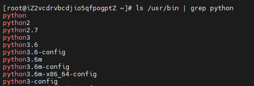
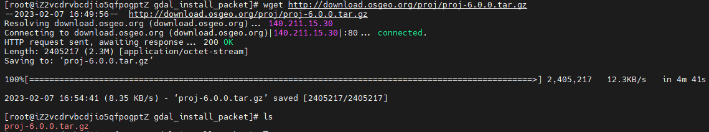
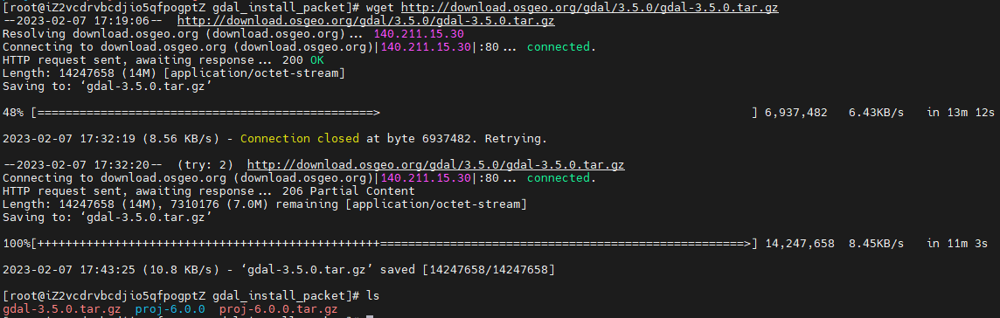
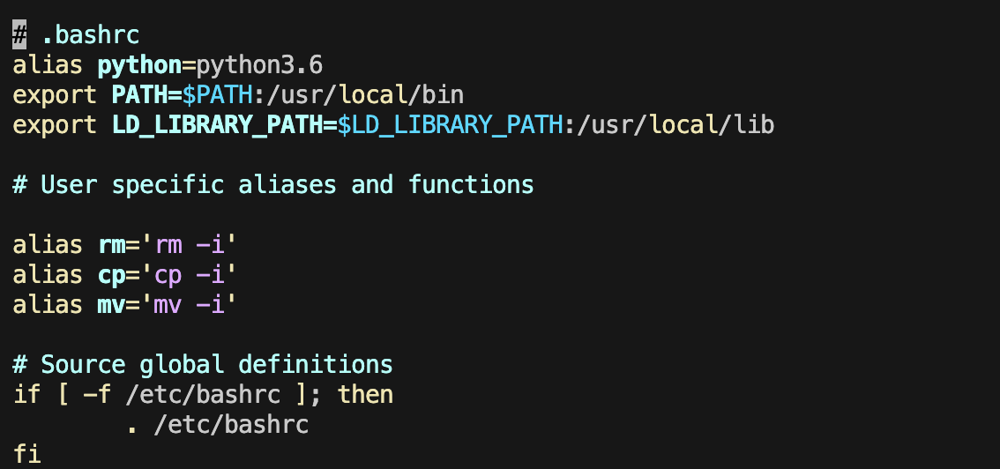
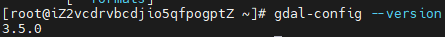
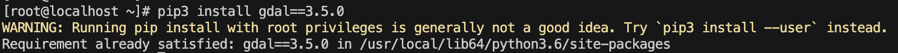

# Python-GDAL编译：小白实践手册

本文为CentOS7下安装python3.6、gdal3.5的编译用例

## 1、安装python3

### 查看python安装版本

```bash
ls /usr/bin | grep python
```



### 没有python3.6便需要安装

```bash
yum install python36
yum install python3-devel 
```

### 配置环境，是python3.6为环境默认python版本

- 打开配置文件

```bash
vim ~/.bashrc
```

- 添加配置

```bash
alias python=python3.6
```

- 激活配置

```bash
source ~/.bashrc
```

- 查看版本

```bash
python -V
```

## 2、准备工作

### 安装编译环境

```bash
sudo yum install -y gcc make subversion gcc-c++ sqlite-devel libxml2-devel numpy swig expat-devel libcurl-devel geos geos-devel
```

### 下载相关的包

- 创建文件夹并进入

```bash
# 创建文件夹
mkdir gdal_install_packet
# 进入
cd gdal_install_packet
```

- 下载proj6

```bash
wget http://download.osgeo.org/proj/proj-6.0.0.tar.gz
```



- 下载gdal3.5

```bash
wget http://download.osgeo.org/gdal/3.5.0/gdal-3.5.0.tar.gz
```



## 3、安装python-GDAL

### 编译proj6

- 解压后进入文件夹

```bash
# 解压
tar xvf proj-6.0.0.tar.gz

#进入文件夹
cd proj-6.0.0
```

- 编译

```bash
# 配置
./configure

# 编译
make -j4

#安装
make install
```

### 编译GDAL

- 解压后进入文件夹

```bash
# 退出文件夹proj-6.0.0
cd ..

# 解压
tar xvf gdal-3.5.0.tar.gz

#进入文件夹
cd gdal-3.5.0
```

- 编译

```bash
# 配置
./configure --with-python=python3 --with-proj=/usr/local

# 编译
make -j4

#安装
make install
```

ps：GDAL配置时出现如下图，SWIG为python、proj标明yes 后续编译才能成功


- 打开配置文件

```bash
vim ~/.bashrc
```

- 添加配置

```bash
export PATH=$PATH:/usr/local/bin
export LD_LIBRARY_PATH=$LD_LIBRARY_PATH:/usr/local/lib
```

- 激活配置

```bash
source ~/.bashrc
```



- 查看版本确定是否成功

```bash
gdal-config --version
```



此时，使用pip3安装gdal就会获得提示如下，标明python-gdal安装成功：

