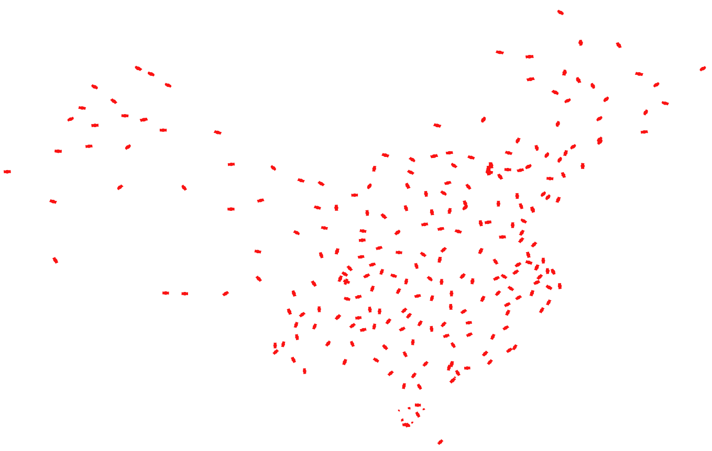
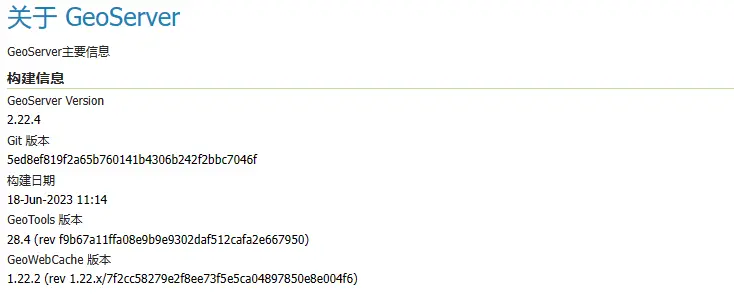
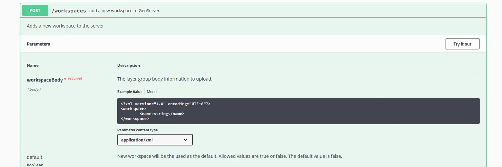
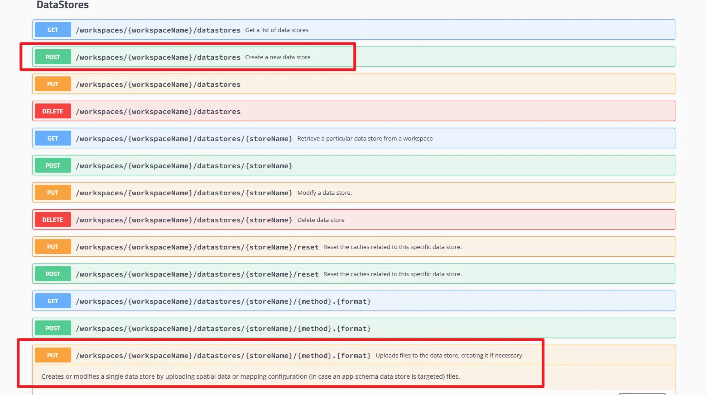
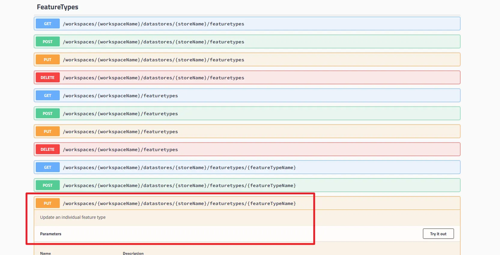
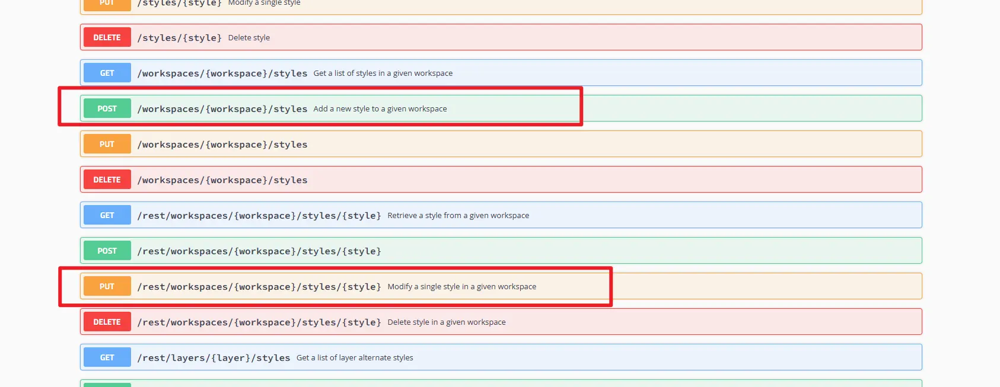
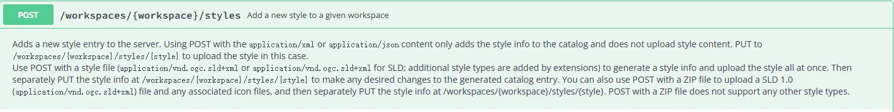
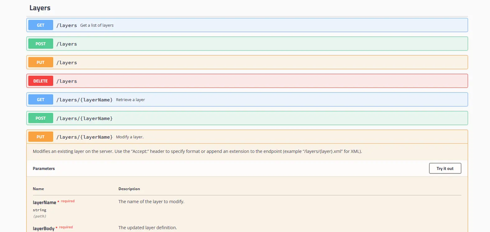
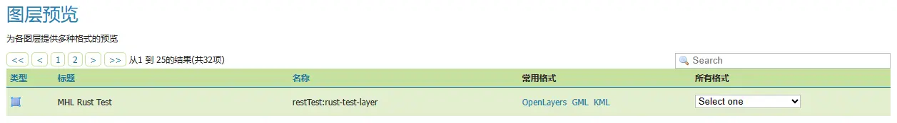
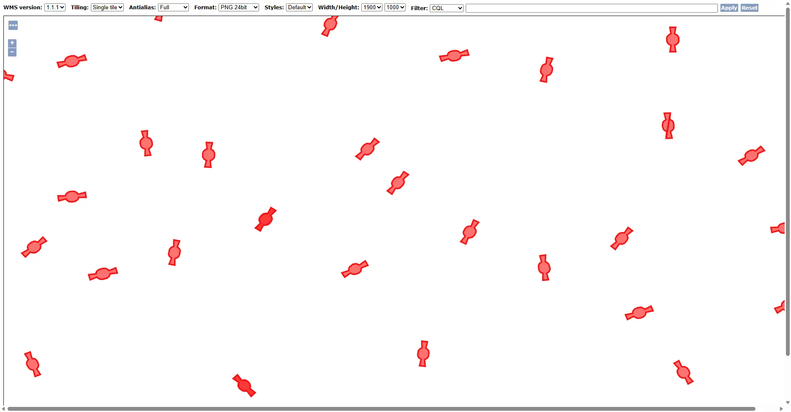

# geoserver自动发布矢量数据（shapfile）

## 前言

最近研究了geoserver rust api，官方文档比较简单、不详细。本文讲述了使用geoserver rust api实现官方文档网页发布shapfile数据的python代码实现。其中，有仓库geoserver-rust实现了大量geoserver的rust api，本文使用并借鉴该库。

### geoserver版本



### 其他

[官方手册](https://www.osgeo.cn/geoserver-user-manual/index.html) ｜ [python geoserver-rust库](https://github.com/gicait/geoserver-rest)

## 步骤

### 1、生成工作区：workplace

生成工作区调用的接口比较简单（.../rest/workspaces），参考接口文档，使用post创建：[GeoServer API Docs](https://docs.geoserver.org/latest/en/api/#1.0.0/workspaces.yaml)

具体实现，调用geoserver-rust的create_workspace。自己写一个简单的实现：

```python
def createWorkplace(
    url: str,
    workplaceName: str,
    userName: str,
    password: str
):
    postUrl="{}/rest/workspaces".format(url)
    xml = "<workspace><name>{}</name></workspace>".format(workplaceName)
    headers = {'Content-type': 'text/xml'}

    resp = requests.post(
        postUrl, 
        auth = (userName, password),
        data = xml, 
        headers = headers
    )
    return resp.status_code
```

### 2、生成数据集 store，自动创建图层

生成store调用的接口为（.../rest/workspaces/{workspaceName}/datastores）:[GeoServer API Docs](https://docs.geoserver.org/latest/en/api/#1.0.0/datastores.yaml)


生成store的时候，个人采用接口（/rest/workspaces/{workspaceName}/datastores/{storeName}/{method}.{format}）实现，此时使用rust api创建数据集后会自动创建图层，图层在矢量数据集里使用featuretype表示：

```python
headers = {'Content-type': 'text/xml'}

putUrl = "{0}/rest/workspaces/{1}/datastores/{2}/external.{3}?filename={2}&update=overwrite".format(
    url, workplaceName, dataStoreName, file_extension
)

r = requests.put(
    putUrl,
    auth = (userName, password),
    data = path,
    headers = headers,
)
```

{method}：可以是"url"， "file"，"external"。"file"从本地源上传文件，请求的正文是文件本身。"url"从远程源上传文件，请求正文是指向要上传的文件的 URL。该 URL 必须对服务器可见。"external"使用服务器上的现有文件。请求正文是现有文件的绝对路径。

geoserver-rust可使用create_shp_datastore上传本地zip压缩的shp文件创建数据集，create_datastore将服务器上数据或是WFS链接创建为数据集，create_featurestore将postgis数据库创建为数据集。后两个不会自动发布图层，需要手动调用publish_featurestore发布图层。

### 3、设置图层参数
使用rust api创建成功后需要重新设置对应图层的参数，此时默认图层名为创建store的shp文件名。采用的接口为：/rest/workspaces/{workspaceName}/datastores/{storeName}/featuretypes/{featureTypeName}。该接口除了设置参数，还有通过键值对recalculate=[string]的计算图层数据源bbox的范围。[GeoServer API Docs](https://docs.geoserver.org/latest/en/api/#1.0.0/featuretypes.yaml)



暂时没有发现geoserver-rust有相关实现的函数，只能自己写。在这里，我设置了图层名、标题、和输出坐标系并重新计算了bbox：

```python
#修改图层的名字并计算bbox
putUrl2="{}/rest/workspaces/{}/datastores/{}/featuretypes/{}?recalculate=nativebbox,latlonbbox".format(
    url, workplaceName, dataStoreName, filename
)
body = """<featureType>
        <name>{}</name>
        <title>{}</title>
        <srs>EPSG:4326</srs> 
    </featureType>""".format(layerName,title)
r2 = requests.put(
    putUrl2,
    auth = (userName, password),
    data = body,
    headers = headers,
)
```

将创建数据集到设置图层参数的步骤写在一个函数里：

```python
def createShpLayer(
    url: str,
    userName: str,
    password: str,
    path: str,
    layerName: str,
    title: str,
    dataStoreName: str,
    workplaceName: Optional[str] = None,
    file_extension: str = "shp",   
):
    
    filename = os.path.basename(path)
    f = filename.split(".")
    if len(f) > 0:
        filename = f[0]

    if workplaceName is None:
        workplaceName = "default"

    headers = {'Content-type': 'text/xml'}

    putUrl = "{0}/rest/workspaces/{1}/datastores/{2}/external.{3}?filename={2}&update=overwrite".format(
        url, workplaceName, dataStoreName, file_extension
    )

    r = requests.put(
        putUrl,
        auth = (userName, password),
        data = path,
        headers = headers,
    )

    if r.status_code == 201:
        #修改图层的名字并计算bbox
        putUrl2="{}/rest/workspaces/{}/datastores/{}/featuretypes/{}?recalculate=nativebbox,latlonbbox".format(
            url, workplaceName, dataStoreName, filename
        )
        body = """<featureType>
                <name>{}</name>
                <title>{}</title>
                <srs>EPSG:4326</srs> 
            </featureType>""".format(layerName,title)
        r2 = requests.put(
            putUrl2,
            auth = (userName, password),
            data = body,
            headers = headers,
        )
        return r2.status_code
    else:    
        return r.status_code
```

### 4、创建样式并赋予图层

通过前三步，数据渲染是默认的灰色。因此我们需要个性化渲染shp，此时需要用到sld。sld（SLD：Styled Layer Descriptor）是描述wms渲染图层样式的一种XML，可参考：[SLD ](https://opengeospatial.github.io/e-learning/sld/text/main.html) 

一个简单要素的sld字符串生成函数：

```python
def getSldXML(
    geom_type: str,
    color: str,
    point_size: Optional[int] = 8,
    stroke_width: Optional[int] = 3,
    fill_color: Optional[str] = None,
    fill_opacity: Optional[float] = 1.0,
):
    if fill_color is None:
            fill_color = color

    if geom_type == "point":
        symbolizer = """
            <PointSymbolizer>
                <Graphic>
                <Mark>
                    <WellKnownName>circle</WellKnownName>
                    <Fill>
                    <CssParameter name="fill">{}</CssParameter>
                    </Fill>
                </Mark>
                <Size>{}</Size>
                </Graphic>
            </PointSymbolizer>
        """.format(
            color, point_size
        )

    elif geom_type == "line":
        symbolizer = """
                <LineSymbolizer>
                    <Stroke>
                    <CssParameter name="stroke">{}</CssParameter>
                    <CssParameter name="stroke-width">{}</CssParameter>
                    </Stroke>
                </LineSymbolizer>
            """.format(
            color,stroke_width
        )

    elif geom_type == "polygon":
        symbolizer = """
                <PolygonSymbolizer>
                    <Fill>
                        <CssParameter name="fill">{}</CssParameter>
                        <CssParameter name="fill-opacity">{}</CssParameter>
                    </Fill>
                    <Stroke>
                    <CssParameter name="stroke">{}</CssParameter>
                    <CssParameter name="stroke-width">{}</CssParameter>
                    </Stroke>
                </PolygonSymbolizer>
            """.format(
            fill_color,fill_opacity,color,stroke_width
        )

    else:
        print("Error: Invalid geometry type")
        return None

    style = """
            <StyledLayerDescriptor xmlns="http://www.opengis.net/sld" xmlns:ogc="http://www.opengis.net/ogc" xmlns:se="http://www.opengis.net/se" xmlns:xlink="http://www.w3.org/1999/xlink" xsi:schemaLocation="http://www.opengis.net/sld http://schemas.opengis.net/sld/1.1.0/StyledLayerDescriptor.xsd" version="1.1.0" xmlns:xsi="http://www.w3.org/2001/XMLSchema-instance">
            <NamedLayer>
                <se:Name>Layer name</se:Name>
                <UserStyle>
                <se:Name>Layer name</se:Name>
                <se:FeatureTypeStyle>
                    <se:Rule>
                    <se:Name>Single symbol</se:Name>
                    {}
                    </se:Rule>
                </se:FeatureTypeStyle>
                </UserStyle>
            </NamedLayer>
            </StyledLayerDescriptor>
            """.format(
        symbolizer
    )

    return style
```

在对应工作空间创建sld，接口为（rest/workspaces/{workspace}/styles）：[GeoServer API Docs](https://docs.geoserver.org/latest/en/api/#1.0.0/styles.yaml)


post的接口描述表明，post只是添加了样式的信息，还需要调用put上传具体样式描述：


实现：

```python
def createStyle(
    url: str,
    userName: str,
    password: str,
    style_name: str,
    sld_xml: str,
    workplaceName: str,
):
    
    postUrl = "{}/rest/workspaces/{}/styles".format(url, workplaceName)
    headers = {"content-type": "text/xml"}

    style_xml = "<style><name>{}</name><filename>{}</filename></style>".format(
            style_name, style_name + ".sld"
        )

    r = requests.post(
        postUrl, 
        auth=(userName, password),
        data=style_xml, 
        headers=headers
    )
    if r.status_code == 201:

            sld_content_type = "application/vnd.ogc.sld+xml"
            header_sld = {"content-type": sld_content_type}
            r_sld = requests.put(
                postUrl + "/" + style_name,
                auth = (userName, password),
                data = sld_xml,
                headers = header_sld,
            )
            return r_sld.status_code
    else:
        return r.status_code
```

最后，令发布的图层使用该样式。调用接口（/rest/layers/{layerName}）：[GeoServer API Docs](https://docs.geoserver.org/latest/en/api/#1.0.0/layers.yaml)


调用geoserver-rust的publish_style完成发布。实现：

```python
headers = {"content-type": "text/xml"}
url = "{}/rest/layers/{}:{}".format(self.service_url, workspace, layer_name)
style_xml = (
    "<layer><defaultStyle><name>{}</name></defaultStyle></layer>".format(
        style_name
    )
)

r = self._requests(
    "put",
    url,
    data=style_xml,
    headers=headers,
)
```

最后调用：

```python
if __name__ == '__main__':

    url = 'http://localhost:3838/geoserver'
    username = 'admin'
    password = 'geoserver'
    workplaceName = 'restTest'
    datastoreName = 'restTest-nofly'

    geo = Geoserver(url, username=username, password=password)
    
    print("----------创建workspace-----------\n")
    workplaceList = geo.get_workspaces() 
    print("workplaceList:", workplaceList)

    isCreate = True
    if not workplaceList["workspaces"] is '':
        for worrplace in workplaceList["workspaces"]["workspace"]:
            if worrplace["name"] == workplaceName:
                print("已经存在workspace:", workplaceName)   
                isCreate=False  
    if isCreate:        
        #geo.create_workspace(workspace=workplaceName)
        code = createWorkplace(
            url = url, 
            workplaceName = workplaceName, 
            userName = username, 
            password = password
        )
        print('createWorkplace:',code)
    print("---------创建workspace--over-----\n")

    print("-------------创建store-----------\n")
    #将已经存在的数据（shp、postgis、WMS等）: Create a datastore within the GeoServer.
    datastoreList = geo.get_datastores(workspace=workplaceName) 

    isCreate=True
    if not datastoreList["dataStores"] is '':
        for datastore in datastoreList["dataStores"]["dataStore"]:
            if datastore["name"]== datastoreName:
                print("已经存在store:",datastoreName)   
                isCreate=False  

    layerName = 'rust-test-layer'
    if isCreate: 
        code = createShpLayer(
            url = url,
            userName = username,
            password = password,
            path='/home/mhl/webserver/geoserver/data_dir/data/restTest/no-fly/no-fly.shp',
            layerName = layerName,
            title='MHL Rust Test',
            dataStoreName = datastoreName,
            workplaceName = workplaceName
        )
        print('createDatastores:',code)

    print("---------创建store--over--------")

    featureList = geo.get_layers(workspace = workplaceName) 
    print("featureList:",featureList)

    sld = getSldXML(
        geom_type = 'polygon',
        color = '#ff0000',
        stroke_width = 3,
        fill_color = '#ff0000',
        fill_opacity = 0.6,
    )

    style_name = 'rust test style'
    createStyle(
        url = url,
        userName = username,
        password = password,
        style_name = style_name,
        sld_xml = sld,
        workplaceName = workplaceName
    )

    geo.publish_style(
        layer_name = layerName,
        style_name = style_name,
        workspace = workplaceName
    )
```

结果：

